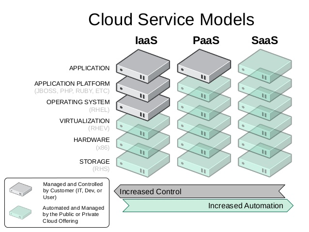

# Alerant - BME PaaS labor
## Tudnivalók
**Oktató:** Nagy Zoltán,Alerant Informatikai Zrt. (+36306803846, nagy.zoltan@alerant.hu)
**Labor email elérhetőség:** alerant.bme.paas.labor@gmail.com

[Minden további tudnivaló itt](Tudnivalok.md)

## Jegyzőkönyv
Az értékelés/érdemjegy alapja, mindenki töltse ki és küldje el az email címével.
A jegyzőkönyvben tesztkérdések és a gyakorlatok anyagaiból felmásolandó feladatok is vannak. Érdemes menet közben tölteni és egy külön dokumentumban külön is tárolni, nehogy elvesszen!
 
[A jegyzőkönvyet itt töltsétek](https://goo.gl/forms/rKN2WAWNCjxpBulS2)

# Célkitűzés, tematika
A labor célja a következő témák áttekintése:
- Alapműveletek konténerben futtatott alkalmazásokkal: konténer létrehozása dockerfile vagy Docker Hub image alapján, Docker registry vizsgálata,  a hoszt és a konténer kapcsolódásának vizsgálata (folyamat-azonosítók, portok, névterek), parancs futtatása a konténerben
- OpenShift deploymentek kezelése: github-ra feltöltött egyszerű projektből OpenShift image és deployment fordítása, telepítése, a pod-ok vizsgálata, kommunikáció a külvilág és a PaaS-ra telepített alkalmazás között (service-ek és route-ok vizsgálata)
- OpenShift pod-ok skálázása: a PaaS-ra telepített alkalmazáshoz terhelést generálunk, majd megvizsgáljuk az automatikus és a manuális lehetőségeket az alkalmazásunkat futtató pod-ok skálázására.
- Hálózati kommunikáció vizsgálata az OpenShift pod-ok között: elemezzük az OpenShift Software Defined Network működését, Wireshark segítségével végigkövetjük egy adatcsomag útját két pod között, továbbá áttekintjük az érintett hálózati protokollokat és virtualizációs technikákat (pl. VXLAN)

# Elméleti áttekintés
## IaaS, PaaS, SaaS

### IaaS = Infrastructure as a Service
Tipikusan HW(+OS) platformot biztosít a használói számára (pl. szükségem van egy 2 CPU-s, CentOS7-re 2G memóriával)
-**Scope:** Infrastruktúra (virtuális gépek és image-ek, storage, hálózati elemek)
-**Előnyök:** erős host gépeken egységes/standard virtualizáció; rapid gépigénylés és létrehozás (akár runtime skálázással)
-**Célcsoport:** üzemeltetők, DevOps
-**Példák:** Amazon EC2, Rackspace, Google Compute Engine, OpenStack. Ennél a labornál az IaaS megoldást az OpenStack nyújtja!
BME IaaS dashboard: https://ossrv1.aut.bme.hu/horizon
### PaaS = Platform as a Service
Tipikusan alkalmazásszervereket, middleware-ket, alkalmazás futtatókörnyezetet biztosít a használói számára (pl. szükségem van egy JBoss JEE szerverre, vagy egy NodeJs futtató környezetre)
-**Scope:** Alkalmazás futtató környezetek (middleware-ek, alkalmazás platformok)
-**Előnyök:** egységes/standard alkalmazás fejlesztés és telepítési környezet; rapid platform igénylés és létrehozás (akár runtime skálázással)
-**Célcsoport:** alkalmazásfejlesztők
-**Példák:** OpenShift, Heroku, Google App Engine. Ennél a labornál a PaaS megoldást az OpenShift nyújtja!
BME PaaS dashboard: https://bmepaas-master.openshift.local
### SaaS = Software as a Service
Tipikusan kész alkalmazások, azok szolgáltatásait biztosítja a használói számára (pl. szükségem van egy levelező rendszerre, CRM alkalmazásra, Webshopra stb.)
-**Scope:** Alkalmazások, szolgáltatások
-**Előnyök:** azonnal elérhető, használható szolgáltatásom van; nincsenek fejlesztési költségek; egyszeri beruházsá helyett rendszeres díjazás
-**Célcsoport:** végfelhasználók
-**Példák:** Office Cloud, Google Apps (Forms, Calendar, ...)

## Docker
## OpenShift áttekintés

## OpenShift skálázási lehetőségek
## OpenShift hálózati kommunikáció

# Gyakorlatok
## Gyakorlat 1. - Docker
[A gyakorlat itt érhető el](Gyakorlat1.md)
## Gyakorlat 2. - OpenShift alapműveletek, alapfogalmak a gyakorlatban
## Gyakorlat 3. - OpenShift S2I deployment

# Opcionális gyakorlatok
## Gyakorlat 4. - OpenShift Skálázási parancsok
## Gyakorlat 5. - Hálózat

# Értékelés
[Az értékelés opcionális, névtelen, itt tölthetitek ki](https://goo.gl/forms/rKN2WAWNCjxpBulS2)
