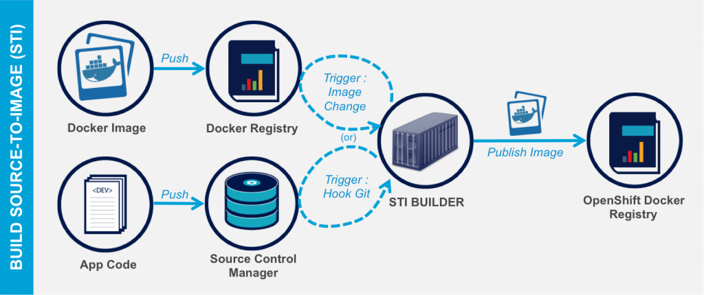

# Alerant - BME PaaS labor
# OpenShift áttekintés
A Docker konténerek önmagukban még nem alkalmasak arra, hogy egy teljes PaaS megoldást nyújtsanak.
Egy PaaS teljeskörű és transzparens infrastruktúrán nyújtja az alkalmazásfejlesztési platformot.

A Docker önmagában nem elég ehhez, a következő problémákra kell még megoldás:
- A különböző konténerek összekapcsolása, management-je fapados, ha csak a Docker-re építkezünk.
- Nincs megoldva a skálázás, failover, high-availability.
- Alkalmazás buildelési, deployálási folyamatok támogatása.

Ezekre a problémákra vannak megoldások:
- Kubernetes, Docker Compose, Docker swarm - konténer menedzsment
- Alkalmazásfejlesztési módszertanok, eszközök: Git vagy más SCM, Jenkins,...
- Hálózati eszközök: OvSwitch, Linux kernel technológiák

Az OpenShift ezekre megoldást nyújt, ráépülve a Docker konténer technológiára és más bevált eszközökre.

# OpenShift Origin vs OpenShift Enterprise


# Alapfogalmak
- **Project**: adminisztratív izoláció, az egyes szállítók külön-külön egymástól izolálva dolgozhatnak. A Node-ot kivéve minden OpenShift entitás/resource Project scopeú.
- **User**: az OpenShift felhasználói, akik tevékenysége jogosultságkezeléssel korlátozható
- **Container, Image, Registry**: Az OpenShift a Docker-t használja konténer technológiaként ezért ezek pontosan a Docker foglamak.
- **Pod**: Egy vagy több konténer, közös tárterülettel, hálózattal. Telepítési, maanagement egység.
- **Node**: Podokat futtató gép.
- **Service**: Egy hálózati portot reprezentál, amin elérhetőek a mögé bekötött POD-ok ill. azok szolgáltatásai. Belső terhelés elosztóként működnek. 
- **Build, BuildConfig**: Egy alkalmazás forráskódjából Docker image készül. Ez a folyamat a Build és ennek a paraméterezése a BuildConfig.
Az OpenShift alapegységei YAML ill. JSON formátumban is leírhatók. 

# OpenShift Architektúra


# Alkalmazásfejlesztés



## Build folyamat
https://docs.openshift.org/latest/dev_guide/application_lifecycle/new_app.html

Három módon témogatja az alkalmazások buildelését az OpenShift::

1. Docker: ez gyakorlatilag a Dockerfile alapú buildelési folyamat
2. S2I -Source to Image: a forráskód és egy Builder docker image alapján lefordítja, összeállítja a végterméket (itt is egy Docker image-et)
3. Custom build - Teljesen customizált build folyamat, saját Builder image-el.
+1 Pipeline build

A Buildeléshez is Docker containerek jönnek létre! Pl. a megadott forrást egy Java+Maven+Nexus -al konfigurált build container fordítja le.

**BuildConfig**

A buildelés konfigurációja, többek között leírja, hogy hol a forrás, mi a fordítás eredménye, milyen "stratégia" szerint fordítson stb.

**ImageStream**

Új image (pl. új verziójú build) elkészülése esetén szükség lehet követő tevékenységekre, pl. automatikus deployra.
Egy ilyen ImageStream egy nézetet biztosít egy vagy több Docker image-re a címkéken keresztül (pl. cimke a webszerveren, db-n,stb.)


**Deployment, DeploymentConfiguration**

Leírja a telepítési folyamt részleteit.

# OpenShift adminisztráció
A master node-on fut, amelyet egy floating IP-n keresztül lehet elérni. A host neve nem a központi
https://bmepaas-master.openshift.local:8443

## Authentikáció és Authorizáció


## OpenShift dashboard

## Legfontosabb CLI parancsok
```shell
oc help
oc CMD --help
oc types            --OpenShift alap entitások leírása
oc login            --belépés
oc new-app          --új alkalmazás létrehozása
```


# OpenShift skálázási lehetőségek

## Replication Controller-ek
Felelősek, hogy mindig a meghatározott számú Pod fusson. Pl. ha leáll egy, akkor indít újat, stb.
Nem felelős azért, hogy mennyi is ez a Pod szám. Nem figyel forgalmat, terhelést, nem kalkulálja ki ezt a számot.

# OpenShift hálózati kommunikáció
A következő hálózati problémákra ad megoldást az OpenShift
- Routing: hogyan érhetőek el kívülről az alkalmazásaink
- Összetartozó Docker containerek (Pod-ok) hogyan kommunikáljanak egymással
- Újrainduló Pod-ok változó IP címeinek lekövetése.


## Routing
A fő problémát az jelenti, hogy a különböző Node-okon létrejövő Pod-ok(akár több Docker container-rel)-ban futó alkalmazást, hogyan lehet kívülről elérni, használni.
A **Service** fogalom egy belső _Port_, ez kívülről még nem érhető el. 

Az OpenShift ezt úgy oldja meg, hogy egy Router komponens segítségével biztosít belépést a külső hívóknak.
Többféle Router is lehet, mi a HAProxy megoldást vizsgáljuk meg. 

Az egyes Node-okra kerül egy Router, egy HAProxy, amely fogadja a hálózati forgalmat és megkeresi a megfelelő Service-ket, amelyek felé delegálnia kell. 
Pl. a :80 -as porton érkező forgalmat a Router a "frontend" címkével rendelkező Service-ek felé irányítja, ahonnan már a megfelelő Pod-ok elérhetőek.

## Docker containerek közötti kommunikáció
A Kibernetes oldja meg, hogy egy Pod kap egy belső IP címet, mintha egy különálló Host géo lenne. Ezen a "virtualizált" hoston futnak a Docker containerek így azok képesek
kommunikálni egymással.
Pod-ok egymással nem (így) kommunikálnak. Pod-ok más Pod-okkal Service-en keresztül kommunikálnak.

## OpenShift DNS


