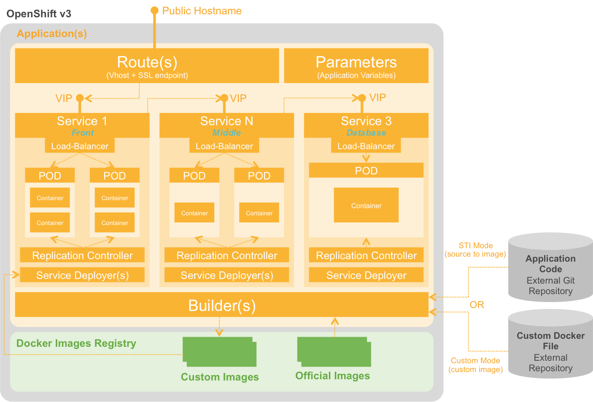
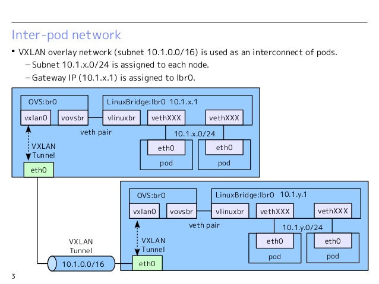

# OpenShift áttekintés
A Docker konténerek önmagukban még nem alkalmasak arra, hogy egy teljes PaaS megoldást nyújtsanak.
Egy PaaS teljeskörű és transzparens infrastruktúrán nyújtja az alkalmazásfuttatási platformot.

A következő problémákra kell még megoldás:
- A különböző konténerek összekapcsolása, management-je fapados, ha csak a Docker-re építkezünk.
- Nincs megoldva a skálázás(akár dinamikusan), failover, high-availability.
- Alkalmazás buildelési, deployálási folyamatok támogatása.
- Tenant/Project izoláció.

Ezekre a problémákra vannak megoldások:
- Kubernetes, Docker Compose, Docker swarm - konténer menedzsment
- Alkalmazásfejlesztési módszertanok, eszközök: Git vagy más SCM, Jenkins,...
- Hálózati eszközök: Open vSwitch, Linux kernel technológiák

Az OpenShift ezekre megoldást nyújt, ráépülve a Docker konténer technológiára és más bevált eszközökre.

# OpenShift Origin vs OpenShift Enterprise


# Alapfogalmak
- **Project**: adminisztratív izoláció, az egyes szállítók külön-külön egymástól izolálva dolgozhatnak. A Node-ot kivéve minden OpenShift entitás/resource Project scopeú.
- **User**: az OpenShift felhasználói, akik tevékenysége jogosultságkezeléssel korlátozható
- **Container, Image, Registry**: Az OpenShift a Docker-t használja konténer technológiaként ezért ezek pontosan a Docker foglamak.
- **Pod**: Egy vagy több konténer, közös tárterülettel, hálózattal. Telepítési, maanagement egység.
- **Node**: Podokat futtató gép.
- **Service**: Egy hálózati portot reprezentál, amin elérhetőek a mögé bekötött POD-ok ill. azok szolgáltatásai. Belső terhelés elosztóként működnek. 
- **Build, BuildConfig**: Egy alkalmazás forráskódjából Docker image készül. Ez a folyamat a Build és ennek a paraméterezése a BuildConfig.
Az OpenShift alapegységei YAML ill. JSON formátumban is leírhatók. 

# OpenShift Architektúra


# Alkalmazásfejlesztés


## Build folyamat
https://docs.openshift.org/latest/dev_guide/application_lifecycle/new_app.html

A következő módon lehet az OpenShift-en alkalmazásokat buildelni:

1. Docker: ez gyakorlatilag a Dockerfile alapú buildelési folyamat
2. S2I -Source to Image: a forráskód és egy Builder docker image alapján lefordítja, összeállítja a végterméket (itt is egy Docker image-et)
3. Custom build - Teljesen customizált build folyamat, saját Builder image-el.
4. Jenkins Pipeline build

A Buildeléshez is Docker containerek jönnek létre! Pl. a megadott forrást egy Java+Maven+Nexus -al konfigurált build container fordítja le.

**BuildConfig**

A buildelés konfigurációja, többek között leírja, hogy hol a forrás, mi a fordítás eredménye, milyen "stratégia" szerint fordítson, mi triggerelje a fordítást stb.

**ImageStream**

A fordítás eredménye egy Docker Image. Az egymást követő buildek láncolata egy ImageStream.
Egy ilyen ImageStream egy nézetet biztosít egy vagy több Docker image-re a címkéken keresztül (pl. cimke a webszerveren, db-n,stb.)

### Forrás konvenciók
A build folyamatokhoz a forrásainknak a nyelvi ill. technológiai standardeket követni kell, pl. Java buildeléshez kell lenni egy pom.xml-nek - Maven build.
Ezen kívül a buildelési folyamat customizálható több ponton:

1. Assemble script - az eredménytermék összecsomagolását lehet vele customizálni (pl. zipek, tarok, war-ok, stb.)
2. Run script - Hogyan kell majd futtatni az előállt eredményterméket.
3. Save-Artifacts - A build során használt csomagok, libek elmenthetők, hogy ne kelljen minden buildnél az összes - nem változott- függőséget letölteni.


## Telepítési folyamat


**DeploymentConfig**

Leírja a telepítési folyamat részleteit.


# OpenShift adminisztráció
1. OpenShift dashboard GUI felület: https://bmepaas-master.openshift.local:8443
2. oc CLI kliens

## Authentikáció és Authorizáció
Jelenleg password nélkül be lehet lépni az előírt felhasználónevekkel.
A CLI OAuth tokennel is használható.


## Legfontosabb CLI parancsok
```shell
oc help
oc CMD --help
oc types            --OpenShift alap entitások leírása
oc login            --belépés
oc new-app          --új alkalmazás létrehozása
```

# OpenShift hálózati kommunikáció
A következő hálózati problémákra ad megoldást az OpenShift
- Routing: hogyan érhetőek el kívülről az alkalmazásaink
- Összetartozó Docker containerek (Pod-ok) hogyan kommunikáljanak egymással
- Újrainduló Pod-ok változó IP címeinek lekövetése.


## Routing
A fő problémát az jelenti, hogy a különböző Node-okon létrejövő Pod-ok(akár több Docker container-rel)-ban futó alkalmazást, hogyan lehet kívülről elérni, használni.
A **Service** fogalom egy hálózati végpontot reprezentál, ez kívülről még nem érhető el. A Service egy "stabil" IP port (nem egy belső docker által osztott port), amelyen elérhető akár több POD által is nyújtott szolgáltatás (loadbalancer)

**Service**

- A service nem kötődik konkrét POD-hoz(hiszen az dinamikusan változhat), hanem ún. selector-ral lehet POD-ok címkéire hivatkozni
- Egy POD egy másik POD-dal Service-en keresztül kommunikálhat egy projekten belül.
- A projekten belüli POD-ok konténereiben környezeti változók jönnek létre az egyes Service-ekhez: SVC_NAME_SERVICE_ADDRESS, _PORT
- A belső DNS alapján is feldoldhatják a Service-ek host neveit: SVC_NAME.PROJECT_NAME.svc.cluster.local

Az OpenShift ezt úgy oldja meg, hogy egy Router komponens segítségével biztosít belépést a külső hívóknak.
Többféle Router is lehet, mi a HAProxy megoldást vizsgáljuk meg. 

Az egyes Node-okra kerül egy Router, egy HAProxy, amely fogadja a hálózati forgalmat és megkeresi a megfelelő Service-ket, amelyek felé delegálnia kell. 
Pl. a :80 -as porton érkező forgalmat a Router a "frontend" címkével rendelkező Service-ek felé irányítja, ahonnan már a megfelelő Pod-ok elérhetőek.

## Docker containerek közötti kommunikáció
A Kubernetes oldja meg, hogy egy Pod kap egy belső IP címet, mintha egy különálló Host géo lenne. Ezen a "virtualizált" hoston futnak a Docker containerek így azok képesek
kommunikálni egymással.
Pod-ok egymással nem (így) kommunikálnak. Pod-ok más Pod-okkal Service-en keresztül kommunikálhatnak.

## OpenShift SDN

https://docs.openshift.com/enterprise/3.0/architecture/additional_concepts/sdn.html#architecture-additional-concepts-sdn

- Open vSwitch alapú megoldás
- Az OpenShift a Pod-okat egy cluster network-be szervezni (etcd-ben regisztrált alhálózatok): 10.1.0.0/16
- Node-onként alhálózatok: 10.1.0.0/24, 10.1.1.0/24,... (256 db alhálózat)
- VNID használat multitenant megoldásoknál

A következő hálózati interfészeket hozza létre Node-onként:
1. br0 - OVS bridge, a Pod-ok ehhez kapcsolódnak (veth párokkal)
- tun0 - OVS port a br0-n az external network felé, Pod-ok default gateway (IP tables, NAT)
- vovsbr - Docker containerek felé
- vxlan0 - Internet felé, Remote container hozzáférésekhez
2. lbr0 - Docker Bridge, a Docker containerek ehhez kapcsolódnak (veth)
-  vlinuxbr - Linux peer virtual Ethernet - Docker containerek eléréséhez




Pod indulása
1. A Docker beköti a containert veth párral az lbr0-ba
2. Az előbbi átkerül az OVS br0-ba
3. OpenFlow route szabályok rögzítése az OVS DB-be

Példa hívási lánc: 

1. A és B konténer egy hoston van: A(eth0,vethA)-B(eth0,vethB)
A->eth0->vethA->br0->vethB->eth0->B
2. A és B konténer más hoston van: A(eth0,vethA)-B(eth0,vethB)
A->eth0->vethA->br0->vxlan0->br0->vethB->eth0->B
3. A és B konténer más hoston van, B pl. egy internetes cím: A(eth0,vethA)
A->eth0->vethA->br0->tun0->...->eth0->B

# OpenShift skálázási lehetőségek

## Replication Controller-ek
Felelősek, hogy mindig a meghatározott számú Pod fusson. Pl. ha leáll egy, akkor indít újat, stb.
Nem felelős azért, hogy mennyi is ez a Pod szám. Nem figyel forgalmat, terhelést, nem kalkulálja ki ezt a számot, csak végrehajt.

## Autoscaling
A Pod-ok erőforrás igényei alapján automatikus skálázás is lehetséges.


